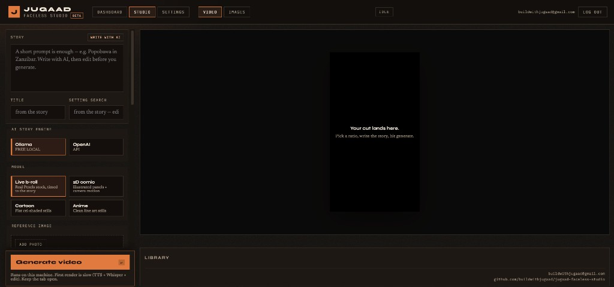

# JUGAAD Faceless Studio

Write a prompt, pick a look, and render a captioned faceless video on your machine — narration, captions, b-roll or illustrated stills, and a music bed. No subscriptions, no watermarks, no usage caps you do not control.

**JUGAAD** (Hindi/Nepali): the art of turning limited resources into a clever solution.



## What you get

- **Studio** at [http://127.0.0.1:8787](http://127.0.0.1:8787) — story, title, setting, model, voice, music, ratio, and a library
- **Video** — live Pexels stock or comic / cartoon / anime stills with camera motion
- **Images** — still boards from a visual prompt (same illustrated models)
- **Write with AI** — Ollama locally (free) or OpenAI from Settings
- Local **Coqui TTS** + **Whisper** captions
- Delete a cut and the related audio, captions, b-roll, stills, script, and job files go with it

The hosted beta keeps accounts and keys. Video generate still runs here (`python studio.py`).

## What's free vs. what needs a key

| Component | Cost | Notes |
|---|---|---|
| Studio + assembly (moviepy / ffmpeg) | Free, local | — |
| Narration (Coqui TTS) | Free, local | One model download, then offline |
| Captions (Whisper) | Free, local | Same |
| Write with AI (Ollama) | Free, local | e.g. `gemma3:4b` |
| Comic / cartoon / anime stills | Free | Pollinations, no key required |
| Live b-roll (Pexels) | Free API key | [pexels.com/api](https://www.pexels.com/api/) |
| OpenAI story expand | Optional paid key | Only if you skip Ollama |
| Epidemic Sound import | Optional partner key | Music / SFX into `assets/background_music/` |
| AI video (`ai_video`) | Paid Pollinations | Optional; not the default studio models |

---

## What you need before you start

Nothing in this list is a cloud account except the optional keys. Generate happens on **your** machine.

### Machine

- A laptop or desktop you can leave running for 5–20 minutes (first render is slower).
- **Python 3.9–3.11**. This repo is developed on **3.9**. Python 3.12+ often breaks Coqui TTS / `bangla`.
- Disk: a few GB free. Coqui VITS + Whisper `small` download once and stay in your user cache.
- Internet for the first model download, Pexels (live), and Pollinations (illustrated). After that, TTS and Whisper work offline.

### Always install (the app will not render without these)

| Piece | Why | How you know it is missing |
|---|---|---|
| Python venv + `pip install -r requirements.txt` | Studio, TTS, Whisper, MoviePy | `ModuleNotFoundError` when you start studio |
| **ffmpeg** | MoviePy writes the `.mp4` | Render log: `ffmpeg` / `FileNotFoundError` / assemble dies |
| **espeak-ng** | Coqui VITS phonemes | TTS crash, or `espeak` / `phonemizer` in the log |

### Optional — only if you use that feature

| Piece | Needed for | Skip it if… |
|---|---|---|
| **Pexels** free API key | **Live b-roll** | You only use 2D comic / cartoon / anime |
| **Ollama** + a pulled model | **Write with AI** (free) | You write the story yourself, or use OpenAI |
| **OpenAI** key | Write with AI without Ollama | Ollama is running, or you type the story |
| **Pollinations** key | Busy free stills pool, or paid `ai_video` | Comic stills usually work without it |
| **Epidemic Sound** partner key | Search/import music & SFX in Studio | You drop `.mp3` files in `assets/background_music/` |
| **Google OAuth** (YouTube Data API) | Upload / edit / delete from Studio | You upload the file yourself |
| Music files in `assets/background_music/` | A bed under the voice | You pick **No music** — render still succeeds |

### Check the binaries (do this once)

```bash
python3 --version          # 3.9.x – 3.11.x
which ffmpeg && ffmpeg -version | head -n 1
which espeak-ng || which espeak
```

If `ffmpeg` or `espeak-ng` prints nothing, install them before `pip install`.

---

## Setup

```bash
git clone https://github.com/a-M-i-T/jugaad-faceless-studio.git
cd jugaad-faceless-studio

python3 -m venv venv
source venv/bin/activate   # Windows: venv\Scripts\activate

pip install -r requirements.txt

# Mac:   brew install espeak-ng ffmpeg
# Linux: sudo apt install espeak-ng ffmpeg
# Windows: install both and add them to PATH
```

Coqui VITS needs **espeak-ng**. Moviepy needs **ffmpeg**. Always `source venv/bin/activate` in the same terminal you use to start studio.

### Keys (`.env` and Settings)

Create a `.env` in this folder (never commit it):

```bash
PEXELS_API_KEY=your_key_here
# optional
# OPENAI_API_KEY=
# OPENAI_MODEL=gpt-4o-mini
# OLLAMA_HOST=http://127.0.0.1:11434
# OLLAMA_MODEL=gemma3:4b
# POLLINATIONS_API_KEY=
# EPIDEMIC_API_KEY=
# GOOGLE_CLIENT_ID=
# GOOGLE_CLIENT_SECRET=
```

You can also paste the same keys in **Settings** after you sign in. Account keys win for that user. A blank Settings field keeps whatever is already saved; `.env` is the fallback.

**Minimum to generate a video**

- Comic / cartoon / anime: no keys. Install Python + ffmpeg + espeak-ng, then generate.
- Live b-roll: add `PEXELS_API_KEY` (or paste it in Settings) **and restart studio** if you only put it in `.env`.

### Optional: Write with AI (Ollama)

1. Install [Ollama](https://ollama.com) and start the app (it listens on `http://127.0.0.1:11434`).
2. Pull the default model (fits a 16 GB Mac):

```bash
ollama pull gemma3:4b
curl -s http://127.0.0.1:11434/api/tags
```

If that `curl` fails, Ollama is not running. Studio will say so when you click **Write with AI**.

---

## Run the studio and generate

```bash
source venv/bin/activate
python studio.py
# → http://127.0.0.1:8787
```

Use port **8787** only (YouTube OAuth redirect is wired to it). Uvicorn does **not** hot-reload — after you change Python, stop the process and run `python studio.py` again.

### First time in the browser

1. Open [http://127.0.0.1:8787](http://127.0.0.1:8787). You get a local sign-in page. Create an account (any email + password ≥ 8 characters). It is stored in `studio/data/jugaad.db` on this machine, not on the hosted beta.
2. Open **Settings**. Paste a Pexels key if you want live stock. Save. Optional: OpenAI, Epidemic, Google (YouTube).
3. Open **Studio → Video**.

### Generate a video (happy path)

1. Type a short idea **or** click **Write with AI**, then edit the story. Generate needs a **fuller story** — at least a few sentences (8+ words). A one-line prompt alone is rejected.
2. Title, setting, and **visual search keys** fill from the story (or from Write with AI). Edit them. Keys are what Pexels / stills search for (`Tokyo Japan empty street night rain`).
3. Pick a look:
   - **Live b-roll** — needs Pexels
   - **2D comic / Cartoon / Anime** — Pollinations stills, no Pexels
4. Optional: drop a **reference photo**. Role **Ghost / creature** (default) locks the monster only; people follow he/she in the story. **Character** locks every face to the photo.
5. Optional: generate stills first on the **Images** tab, then **Use stills in reel** so Video reuses that board (no redraw).
6. Pick voice, music (or **No music**), frame (9:16 for Shorts), and length.
7. **Generate video**. Keep the tab open. Watch the log in the UI.

**First run is slow.** Coqui downloads VITS; Whisper downloads `small`. After that, those steps are local.

When it finishes, the cut is in the library and on disk as `output/{title}.mp4`.

**Images** is the same desk for still boards. It wants a visual prompt, not a voiceover script.

### Smoke-test without the browser

If the UI is confusing, prove the pipeline in the terminal first:

```bash
source venv/bin/activate
# illustrated — no Pexels key
python main.py scripts/popobawa.py model=comic music=off
# live stock — needs PEXELS_API_KEY
python main.py scripts/popobawa.py model=live
```

A good run ends with a file in `output/`. If this fails, the Studio log will fail the same way — fix the terminal error first.

### Publish to YouTube

1. In [Google Cloud](https://console.cloud.google.com/apis/library/youtube.googleapis.com) enable **YouTube Data API v3**
2. Create an OAuth client (Web application)
3. Add redirect URI `http://127.0.0.1:8787/youtube/callback` (must match exactly)
4. Paste the client id and secret in **Settings**, save, then **Connect YouTube**
5. In the library, click **YT** on a cut. Default visibility is **unlisted**
6. Manage uploads from **Studio** or **Dashboard** (edit title / description / privacy, open, delete)

Tokens stay encrypted on the account. The browser never sees the client secret.

If list / edit / delete fails after an old connect, click **Reconnect** in Settings (the app now asks for the full YouTube manage scope, not upload-only).

---

## When something is missing — how to debug

Work top to bottom. Most failures are a missing binary, a missing key for **that** model, or studio not restarted after `.env` changed.

### 1. Confirm studio is the local one

```bash
curl -s http://127.0.0.1:8787/api/health
# {"ok":true,"generate":true,"postgres":false}
```

| You see | Meaning |
|---|---|
| Connection refused | Studio is not running. `python studio.py` from the project folder with the venv on. |
| `"generate":false` | You are on the hosted beta, or `JUGAAD_DISABLE_GENERATE=1`. Generate only works with local `python studio.py`. |
| Browser opens a different host | You are not on `127.0.0.1:8787`. |

### 2. Read the render log, not only the red banner

In Studio, a failed job shows **Render failed (exit N). Check the log.** Scroll the log. The last `RuntimeError` / `FileNotFoundError` line is the real reason.

Same log in the terminal if you ran `python main.py …`.

| Log / UI message | What is missing | Fix |
|---|---|---|
| `No PEXELS_API_KEY set` | Pexels key | Get a key at [pexels.com/api](https://www.pexels.com/api/). Put it in `.env` **or** Settings. Restart studio if you used `.env`. Or switch the model to comic / cartoon / anime. |
| `No Pexels clips found` | Key wrong, quota, or search too weird | Check the key in Settings. Soften visual keys (`empty street night rain`). Retry. |
| `Ollama isn't running` | Ollama app / daemon | Start Ollama. `curl http://127.0.0.1:11434/api/tags`. Or type the story yourself. |
| `Model gemma3:4b is not installed` | Pulled weights | `ollama pull gemma3:4b` (or set `OLLAMA_MODEL` to a model you already have). |
| `Add an OpenAI key in Settings` | OpenAI provider selected, no key | Paste `OPENAI_API_KEY` in Settings, or switch Write with AI to Ollama. |
| `OpenAI rejected that key` | Bad / revoked key | New key at [platform.openai.com/api-keys](https://platform.openai.com/api-keys). |
| `Write a fuller story` | Prompt too short | Write with AI, or paste a few sentences. Generate does not accept a one-liner. |
| `espeak` / `phonemizer` / TTS dies on first audio | espeak-ng | `brew install espeak-ng` or `sudo apt install espeak-ng`. Confirm `which espeak-ng`. |
| `ffmpeg` / MoviePy writer error | ffmpeg | `brew install ffmpeg`. Confirm `which ffmpeg`. |
| `ModuleNotFoundError: TTS` / `whisper` / `moviepy` | venv or pip | `source venv/bin/activate` then `pip install -r requirements.txt`. |
| `Failed to generate image` / Pollinations HTTP 422 | Free image API or reference blocked | Retry. Drop the reference or set role to **Style** / **Off**. Optional Pollinations key in Settings. |
| `AI video needs POLLINATIONS_API_KEY` | Paid video model | Add a key, or do not use CLI `model=ai_video`. |
| `Add your Epidemic Sound key` | Epidemic import | Settings → Epidemic, or drop files in `assets/background_music/`. SFX cues still leave pauses without a key. |
| `Connect YouTube in Settings first` | No OAuth tokens | Settings → save Google client → Connect. |
| `Save a Google client id and secret` | Missing OAuth app | Create a Web client; redirect `http://127.0.0.1:8787/youtube/callback`. |
| YouTube list empty / cannot edit | Old upload-only token | Settings → **Reconnect**. |
| `A render is already running` | One job at a time | Wait, or restart studio if a job is stuck. |
| `Render crashed while loading TTS` / exit `-11` | OpenBLAS / Python.app on Mac | Run `python studio.py` from Terminal in this folder (uses `venv/bin/python3`). Click Generate again. |
| First generate hangs for many minutes, no error | Downloading TTS or Whisper | Wait. Watch the terminal for download progress. Later runs reuse the cache. |
| UI looks stale after a git pull | Browser cache | Hard-refresh. Studio HTML pins `app.js?v=…`. |
| Keys in `.env` ignored | Process started before the file existed | Stop studio, save `.env`, start again. Or paste keys in Settings (no restart). |
| Port already in use | Another studio on 8787 | Quit the old process. Do not pick a new port if you use YouTube OAuth. |

### 3. Quick “what did I forget?” checklist

```bash
source venv/bin/activate
python3 --version
ffmpeg -version | head -n 1
espeak-ng --version | head -n 1

# .env loaded? (prints 1 or 0 — never prints the key)
python -c "from dotenv import load_dotenv; load_dotenv(); import os; print('pexels', int(bool(os.getenv('PEXELS_API_KEY'))))"

# Ollama (only if you use Write with AI)
curl -s http://127.0.0.1:11434/api/tags | head

# Studio process
curl -s http://127.0.0.1:8787/api/health
```

`pexels 0` and you chose **Live b-roll** → that is the bug. Add the key or change model.

### 4. Where files land (so you can see what ran)

```
assets/audio/              # TTS wavs
assets/captions/           # Whisper word timings
assets/broll/              # Pexels clips
assets/stills/             # illustrated panels
assets/refs/               # uploaded reference photos
assets/background_music/   # your beds
output/                    # finished mp4s
scripts/studio/            # throwaway scripts the UI writes
studio/data/               # local accounts, jobs, YouTube mapping (gitignored)
```

If `assets/audio/` never gets a wav, TTS failed (espeak / model download). If audio exists but there is no `output/*.mp4`, assembly or footage failed (ffmpeg / Pexels / Pollinations).

---

## CLI

Same pipeline without the browser:

```bash
python main.py scripts/popobawa.py
python main.py scripts/popobawa.py model=live
python main.py scripts/popobawa.py model=comic
python main.py scripts/popobawa.py model=live music=off
python main.py scripts/popobawa.py music=horror_piano voice=p326
```

Output lands in `output/{name}.mp4`. CLI `model=` overrides the script's `VIDEO_TYPE`. Default length cap is **180 seconds** (YouTube Shorts).

Drop royalty-free `.mp3` / `.wav` files in `assets/background_music/`. Default is a random pick. Pin a track with `music=horror_piano`, skip with `music=off`.

## Visual models

| Studio / CLI | What you get |
|---|---|
| Live b-roll · `live` | Real Pexels clips, timed to the story |
| 2D comic · `comic` | Illustrated panels + camera motion |
| Cartoon · `cartoon` | Flat cel-shaded stills |
| Anime · `anime` | Clean line-art stills |
| `ai_video` | Paid Pollinations motion (CLI) |

Defaults live in `config.py` (`VIDEO_TYPE`, `IMAGE_MODEL`, `TTS_SPEAKER`). CLI wins.

## Your own legend

Copy `scripts/popobawa.py` or `scripts/qallupilluk.py` and replace `PARTS`:

```python
VIDEO_TYPE = "live"           # or comic / cartoon / anime
CHARACTER_SEED = 1995
CHARACTER_LOCK = "Popobawa, one-eyed bat-winged shetani, leathery wings"

PARTS = [{
    "text": "Your narration…",
    "broll_query": "night village, lanterns, empty street",
}]
```

Then:

```bash
python main.py scripts/your_legend.py
```

Studio writes throwaway scripts under `scripts/studio/` (gitignored). Deleting the cut in the library removes those, plus audio, captions, b-roll, stills, and the job file. Keep the hand-written files in `scripts/`.

## Tuning

- **Voice** — studio picker, or `voice=p326` / `TTS_SPEAKER` in `config.py`. Labels are by ear for this Coqui VCTK checkpoint (IDs do not match the official speaker sheet).
- **Captions** — two words per chunk in `main.py` (punchy). Try 3–4 for a calmer read.
- **Whisper** — `WHISPER_MODEL = "small"` in `config.py`. Use `"tiny"` if CPU is slow.
- **First run** — TTS and Whisper download models once, then run offline.

## Layout

```
├── studio.py              # browser studio
├── main.py                # CLI orchestrator
├── config.py              # paths, voices, models, lengths
├── scripts/               # hand-written stories (keep)
├── scripts/studio/        # generated per cut (safe to delete)
├── assets/background_music/
├── assets/refs/           # uploaded reference photos
└── output/                # finished mp4s
```

## License

Use and remix for your own channel. Do not commit `.env` or API keys.
